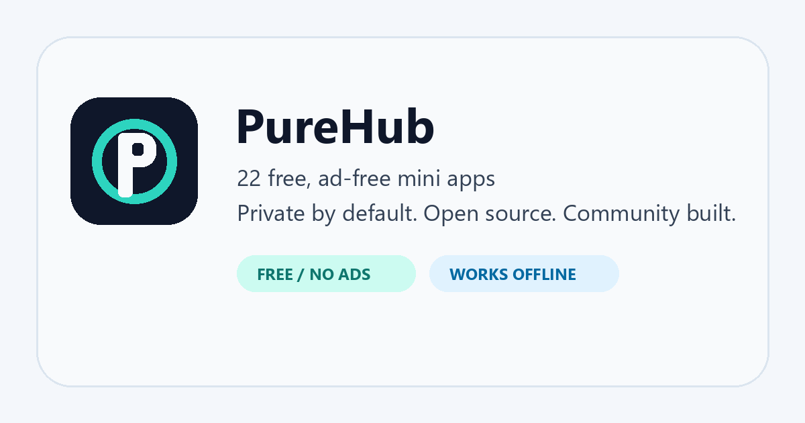
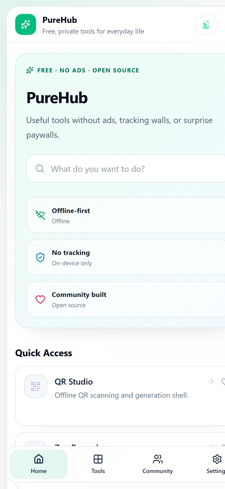
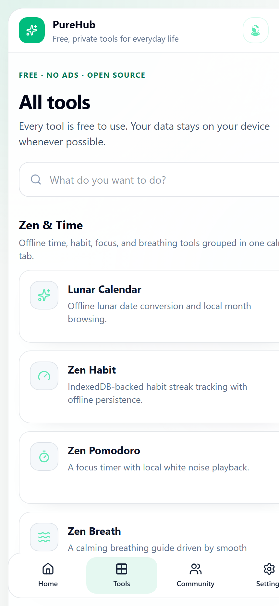
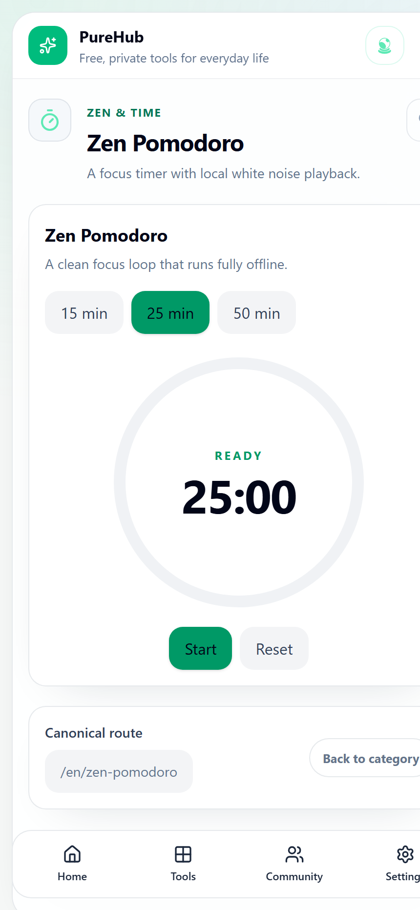

<p align="center">
  
</p>

<h1 align="center">PureHub</h1>

<p align="center">
  <strong>Small, practical utilities for focus, measurement, scanning, documents, privacy, audio, and personal finance.</strong><br />
  Free to use. No ads. No mandatory account. Open source.
</p>

<p align="center">
  <a href="https://hub.blissbiovn.com/en"><strong>Open the web app</strong></a>
  &middot; <a href="https://hub.blissbiovn.com/en/tools">Browse all tools</a>
  &middot; <a href="https://hub.blissbiovn.com/en/download">Download Android</a>
  &middot; <a href="https://github.com/shoyrulove-dev/PureHub/releases">Releases</a>
  &middot; <a href="https://t.me/purehubaaa">Community updates</a>
</p>

<p align="center">
  <a href="https://github.com/shoyrulove-dev/PureHub/actions/workflows/web-ci.yml"></a>
  <a href="https://github.com/shoyrulove-dev/PureHub/actions/workflows/android-ci.yml"></a>
  <a href="https://github.com/shoyrulove-dev/PureHub/releases"></a>
  <a href="LICENSE"></a>
</p>

## What is PureHub?

PureHub is an offline-first utility collection for Android and the web. Instead of installing many single-purpose apps filled with advertising and tracking, you get 25 practical tools plus one community hub in a consistent interface.

Typical uses include scanning or creating a QR code, running a Pomodoro session, extracting text from an image, converting units, checking a level or compass, splitting a bill, tracking expenses, and following a guided breathing exercise.

PureHub is currently beta software. The web app is available now, and signed Android preview builds are published through GitHub Releases.

The flagship lineup now includes the Zen tools, QR Studio, the OCR + PDF Document Suite, Speaker Cleaner, the private Finance Suite, and the Compass + Level + Sound Sensor Suite.

Zen Habit, Zen Pomodoro, and Zen Breath now share a complete Zen Suite experience on web and Android. Pomodoro includes quick/custom focus sessions, private weekly rhythm tracking, and local soundscapes; Breath includes timed goals, accessible motion, optional cues, and private completion history.

## Try it now

Start with the highest-demand workflows:

- [Bubble Level](https://hub.blissbiovn.com/en/bubble-level) — flat and edge modes, local zero calibration, adjustable tolerance, and private sensor readings.
- [QR Studio](https://hub.blissbiovn.com/en/qr-studio) — inspect, scan, create, and keep useful codes locally.
- [OCR Studio](https://hub.blissbiovn.com/en/ocr-text) — turn camera pages into editable text and searchable PDF without a cloud account.
- [Download Android](https://hub.blissbiovn.com/en/download) — signed APKs, checksums, and architecture-specific builds.

| Destination | Link |
| --- | --- |
| Homepage | [hub.blissbiovn.com/en](https://hub.blissbiovn.com/en) |
| Complete tool catalog | [hub.blissbiovn.com/en/tools](https://hub.blissbiovn.com/en/tools) |
| Android APK and checksum | [hub.blissbiovn.com/en/download](https://hub.blissbiovn.com/en/download) |
| Changelog | [hub.blissbiovn.com/en/changelog](https://hub.blissbiovn.com/en/changelog) |
| Community and feedback | [hub.blissbiovn.com/en/community](https://hub.blissbiovn.com/en/community) |

## The 26 mini-app experiences

| Category | Included tools |
| --- | --- |
| Zen & Time | Lunar Calendar, Zen Habit, Zen Pomodoro, Zen Breath |
| Measure & Tools | Compass, Bubble Level, Decibel Meter, Smart Flashlight, Unit Converter |
| Vision & Documents | QR Studio, Doc to PDF, OCR Studio, Color Grabber, Photo Privacy |
| Security & Audio | Speaker Cleaner, Deep Cleaner, Wi-Fi Analyzer, Password Vault, Wallpaper Changer |
| Files & Creator | Authenticator Vault, File Studio, Screen Recorder |
| Finance & Community | Bill Splitter, Expense Tracker, Decision Wheel, PureHub Community |

Some tools depend on device capabilities such as a camera, microphone, motion sensor, storage access, or location permission. Availability and precision can differ by browser and device.

## Product preview

<table>
  <tr>
    <td align="center"><br /><strong>One calm home</strong></td>
    <td align="center"><br /><strong>All tools</strong></td>
    <td align="center"><br /><strong>Zen Pomodoro</strong></td>
  </tr>
</table>

## Why this project exists

- **Free and ad-free:** no banner ads, interstitials, subscriptions, or surprise paywalls.
- **Privacy-first:** local processing and on-device storage are preferred whenever the platform allows it.
- **Offline-first:** the PWA caches its application shell; the Android app deliberately removes the `INTERNET` permission from release builds.
- **Open source:** product decisions, releases, security limitations, and implementation are visible here.
- **Community-built:** bug reports, device testing, roadmap votes, and contributions shape what gets improved next.

Privacy-first does not mean every feature has completed an independent security audit. In particular, Password Vault is experimental; read [SECURITY.md](SECURITY.md) and the [internal vault review](docs/PASSWORD_VAULT_SECURITY_REVIEW.md) before storing sensitive data.

## Platforms and architecture

| Surface | Stack | Purpose |
| --- | --- | --- |
| Web/PWA | React 19, TypeScript, Vite, Tailwind CSS | Installable multilingual web experience with offline support |
| Android | Kotlin, Jetpack Compose, CameraX, Room, ZXing, ML Kit/Tesseract flavors | Native offline-first app for Android 8.0+ |
| Hosting/automation | Vercel, GitHub Actions | Web deployment, CI, signed Android releases, checksums, and privacy gates |

The public app supports English, Vietnamese, and Chinese routes. User content is stored locally for tools designed around private on-device workflows. The operator backend is deployed separately from a private repository and is not required to use the mini apps.

## Run locally

### Web app

Requirements: Node.js 24+ and npm.

```bash
cd pwa
npm install
npm run dev
```

Quality checks:

```bash
cd pwa
npm run lint
npm run build
```

### Android app

Requirements: JDK 17 and the Android SDK for API 36.

```bash
./gradlew testStandardDebugUnitTest lintStandardDebug assembleStandardDebug
./gradlew testFdroidDebugUnitTest lintFdroidDebug assembleFdroidDebug
```

On Windows PowerShell:

```powershell
.\gradlew.bat testStandardDebugUnitTest lintStandardDebug assembleStandardDebug
.\gradlew.bat testFdroidDebugUnitTest lintFdroidDebug assembleFdroidDebug
```

The standard flavor keeps ML Kit OCR for recognition quality. The `fdroid` flavor uses ZXing and Tesseract and its runtime dependency graph contains no ML Kit, Google Play Services, or Firebase. See the [F-Droid flavor architecture and verification guide](docs/FDROID_FLAVOR.md). APKs are written under `app/build/outputs/apk/<flavor>/debug/`. Production signing credentials are intentionally not stored in the repository; see [ANDROID_RELEASE_CHECKLIST.md](ANDROID_RELEASE_CHECKLIST.md).

Official F-Droid submission is tracked directly through `fdroiddata`; PureHub does not claim a listing until a public F-Droid package page exists. Google Play is intentionally deferred until at least October 16, 2026 and will proceed only if tester coverage and every launch goal are complete. See the [distribution submission dossier](docs/DISTRIBUTION_SUBMISSION.md).

## Repository map

| Path | Contents |
| --- | --- |
| [`pwa/`](pwa/) | React PWA, mini-app surfaces, localization, SEO, and public pages |
| [`app/`](app/) | Native Android application |
| [`.github/workflows/`](.github/workflows/) | Web and Android CI plus signed release pipelines |
| [`docs/`](docs/) | Security and community-operation documentation |
| [`marketing/`](marketing/) | Brand assets, screenshots, and reproducible demo-video tooling |

## Releases

The current preview is PureHub 1.0.0-beta.24. Its PWA is deployed to production, and signed Android artifacts are published through GitHub Releases after CI and physical-device verification. Each Android release provides:

- a signed APK for testers;
- an AAB for future store distribution;
- `SHA256SUMS.txt` for integrity verification;
- build provenance generated by GitHub Actions.

Android releases are prereleases while device coverage, accessibility, and workflows continue to mature. Download only from the PureHub download page or this repository.

## Contributing and feedback

You do not need to write code to help. Useful contributions include:

- reporting the device, browser/app version, tool, and exact reproduction steps for a bug;
- testing a release APK and describing where the UI feels unclear;
- suggesting a focused improvement to an existing tool;
- improving translations, accessibility, tests, documentation, or implementation.

Start with [CONTRIBUTING.md](CONTRIBUTING.md), use the issue templates, or join the [Telegram update channel](https://t.me/purehubaaa). Please follow the [Code of Conduct](CODE_OF_CONDUCT.md). Security issues must follow [SECURITY.md](SECURITY.md), not a public issue.

## Current direction

The immediate priorities are reliability on real devices, deeper workflows for the most-used tools, accessibility, honest privacy boundaries, and community feedback. PureHub will remain free, ad-free, and open source.

See the [original 22-app flagship report](ALL_MINIAPPS_FLAGSHIP_REPORT_2026-08-10.md) for the previous catalog milestone, verification results, and video campaign status.

## License

PureHub is available under the [MIT License](LICENSE).
